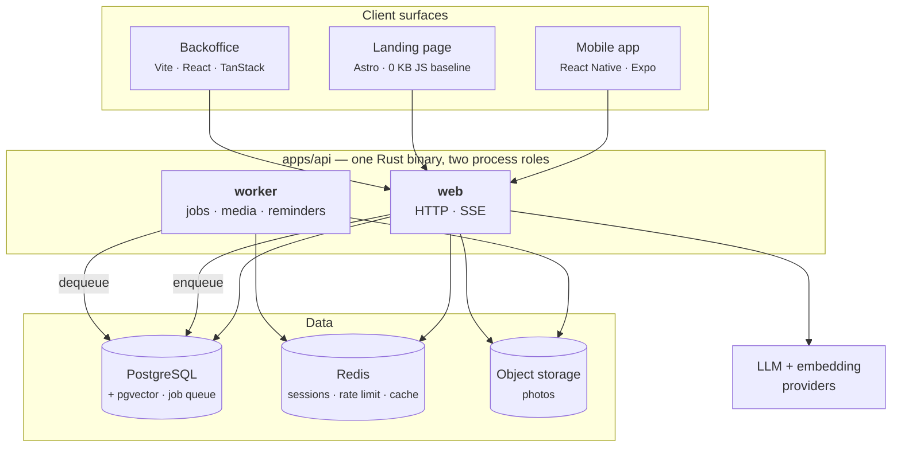
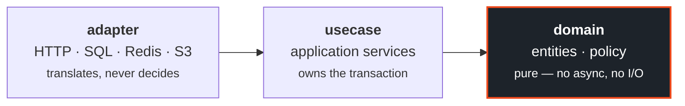
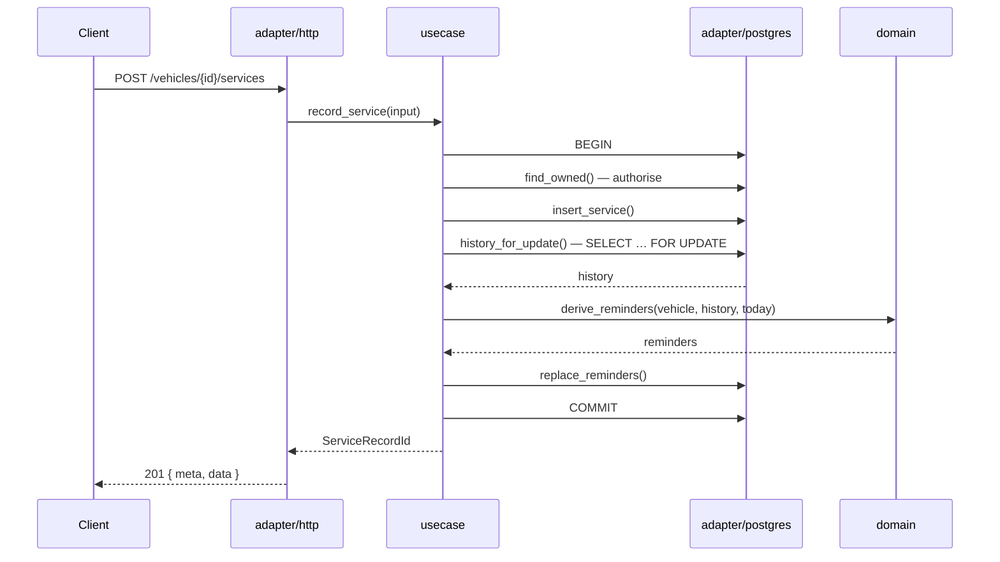
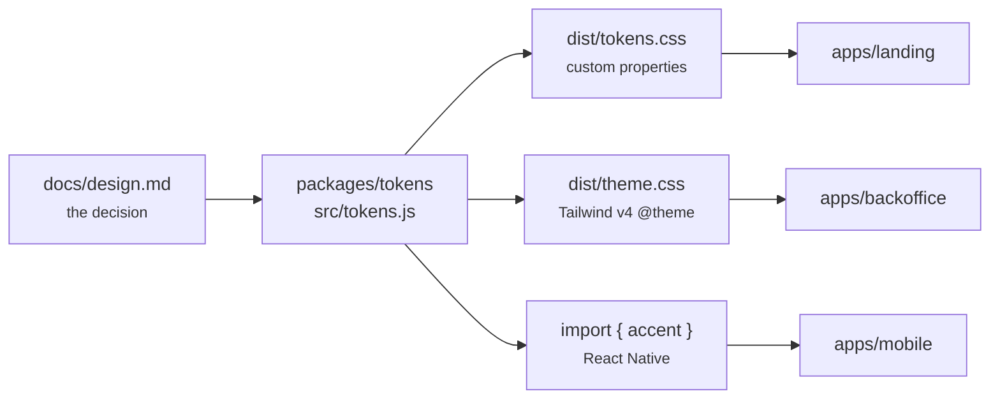

# AnakMobil.id

> Mobil lo. Build lo. Komunitas lo.

An Indonesia-first automotive platform: a digital garage that remembers your car, a community that has already solved your problem, and an AI assistant that answers from that community rather than from the open internet.

Three things make it different from a forum with a database attached. Every vehicle is a **structured record** — brand, model, generation, variant — so a question about wheel fitment can be answered with numbers instead of guesses. Every AI answer carries **evidence you can open**, pointing back at the build or repair it came from. And every answer states **how confident it is**, computed from how well the evidence matches *your* car, never from how similar the text looked.

> **Early.** The backend serves two health probes and nothing else — no schema, no authentication, no business endpoints. The landing page is a holding page. The mobile app and backoffice are not scaffolded. Nothing is deployed anywhere. See [Status](#status) for what actually exists.

---

## Principles

These are product decisions with teeth. Each has already cost an argument, and each is written as acceptance criteria somewhere so it cannot be quietly reversed.

**Contributing to the community is never paywalled.** Sharing a build, reporting a problem, recording a service entry, answering someone's question — free forever, at every tier. Paid tiers buy AI depth and personal tooling, never the right to speak. A platform whose knowledge comes from its members cannot charge those members for the act of contributing it.

**Private vehicle data is filtered on the server, including from admins.** Number plate, VIN, purchase price, and service costs never leave the server for anyone who should not see them. The client is never trusted to hide them, and an admin session is not a reason to expose them. Leaked plate and VIN data cannot be recalled.

**An AI answer never ships without its safety warning.** Brakes, steering, structural damage, fuel leaks, electrical faults, overheating — these carry a prominent warning and a recommendation to see a technician. Answers are persisted whole *before* being considered complete; streaming is transport for the typing experience only. A dropped connection must never leave someone reading an answer whose warning never arrived.

**Confidence comes from constraint match, not embedding distance.** Semantic similarity is not vehicle identity. Retrieval filters brand, model, generation, and variant *before* the vector search, and confidence is derived from how well the evidence matches your actual car plus where it came from. A confident answer about the wrong car is worse than no answer.

**Reported, hidden, or deleted content is never cited as evidence.** There is a path that pulls content back out of the index. Framing community text as "evidence" with a confidence badge does more damage with bad content than a plain feed would.

**Nothing is seeded with fake data.** No invented member counts, no fabricated testimonials, no screenshots of data that never existed. The platform launches empty and says so — the low-data state is designed as a primary experience, not a fallback.

---

## Architecture



**Web and worker are separate processes from the same binary.** Image compression is CPU-heavy; running it inside the web process would starve HTTP and SSE during an upload spike. That is a blast-radius decision, not a step toward microservices — still one codebase, one database, one deployable artifact.

**The job queue is Postgres, not Redis.** The failures that matter — a worker dying mid-job, a duplicate push notification, a poisoned message — have to be solved with leases, retries, and dead-lettering either way. Redis does not remove that work, it only adds a service to operate.

### Backend layers

Dependencies point one way, and the compiler enforces it.



`crates/domain` has no `axum`, no `sqlx`, no `reqwest`, no `redis` in its `Cargo.toml`. Writing `use axum::Json;` inside it does not produce a lint — it produces `error[E0432]: unresolved import`. The boundary is not a convention anyone has to remember.

A typical write flows through all three layers exactly once:



The lock on the history read is what keeps two concurrent writes from each deriving reminders from a stale view. Repositories take a connection rather than a pool precisely so the use case can own that boundary.

---

## Repository layout

```
anak-mobil/
├── apps/
│   ├── api/            Rust · axum · Cargo workspace
│   ├── landing/        Astro — holding page today, AM-341 replaces it
│   ├── backoffice/     Vite · React · shadcn · TanStack (E13, not started)
│   └── mobile/         React Native · Expo              (E0–E12, not started)
├── packages/
│   ├── assets/         brand marks shared by all three frontends
│   ├── tokens/         design tokens generated from docs/design.md
│   └── api-types/      TypeScript types from the OpenAPI  (AM-351, not started)
└── docs/               PRD · design system · feature breakdown
```

`apps/api` is a Cargo workspace nested inside the JS workspace. It has no `package.json`, so the JS tooling skips it entirely; the two build systems coexist without knowing about each other.

### One source for colour and type

`packages/tokens` holds the palette, spacing, radius, and type stack as plain JavaScript, and generates two stylesheets from it: custom properties for Astro, and a Tailwind v4 `@theme` block for the backoffice. React Native imports the JavaScript directly.



Three surfaces, one palette. Change the orange once and all three move; there is nowhere to change it in only two of them.

---

## Getting started

Requires Rust 1.96+ and Node 22+, plus Docker for Postgres and Redis once AM-353 lands.

```bash
npm install
cp apps/api/.env.example apps/api/.env
make check         # every gate in the repository
```

Individually:

```bash
make be-check      # fmt · clippy · tests · the domain-boundary assertion
make be-web        # start the HTTP role
make be-worker     # start the background role

make ds-check      # regenerate the design tokens and test them
make fe-dev        # landing dev server on :4321
make fe-check      # landing type check and build
```

`make` with no target lists everything.

The backend runs from the repository root through those wrappers because Cargo insists on being invoked inside its own workspace, and typing `cd apps/api` forty times a day is a papercut worth removing. The frontend targets exist for the same reason, and `fe-build` regenerates the tokens first so a stale `dist/` cannot ship yesterday's palette.

### Configuration

Every key is read once at startup. Missing and malformed values are reported **together**, then the process exits — it never starts half-configured, and you never fix one variable per restart.

```
$ anakmobil web
Error: configuration is invalid (3 problem(s)):
  - `APP_ENV` is invalid: expected `development` or `production`, got `staging`
  - `BIND_ADDR` must include a port, got `0.0.0.0`
  - `DATABASE_URL` must start with `postgres`
see .env.example for the expected keys
```

Secrets are wrapped in a type whose `Debug` prints `Secret(<redacted>)`, so a stray `dbg!` or a panic backtrace cannot leak a password into a log aggregator. At boot the roles print the connection *target* — `db.internal:5432` — with credentials stripped.

---

## Quality gate

**Backend.** Not Sonar; Rust's support there is thin. The chain is:

```bash
cargo fmt --check
cargo clippy --all-targets --all-features -- -D warnings
cargo nextest run
cargo llvm-cov          # ≥ 90% on new code
cargo audit
cargo deny check
```

Hard rules, enforced rather than requested: no `unwrap`, `expect`, `panic!`, or `todo!()` on a production path (tests are exempt); `unsafe` is forbidden crate-wide; SQL always goes through sqlx macros with bound parameters, never `format!`.

**Frontend.** `astro check` plus a production build, and two assertions on the built output that no type checker can make:

- the site ships **zero** JavaScript files, until the waitlist island earns the first one (AM-341 AC6);
- the design tokens actually reached the HTML. A dropped `@import` still builds — it only warns, and every colour silently resolves to nothing.

Both run in CI on every push that touches a page or a token.

---

## Status

Foundation only.

`apps/api` serves HTTP. It validates its configuration, logs structurally, answers `/healthz` and `/readyz`, and drains on `SIGTERM`. The response envelope and the failure-to-HTTP mapping exist and are tested. There are still **no tables, no entities, and no business endpoints** — the only routes are the two probes.

`packages/tokens` generates all three artifacts and is tested. `apps/landing` builds a holding page; the real landing page in AM-341 waits on the waitlist form and its storage (AM-346), because a signup form with nowhere to post is worse than no form.

Nothing is deployed. There is no database schema and no authentication.

Work is tracked in Jira project **AM**. The build order and its reasoning live on epic **AM-349**; the current sprint carries the label `sprint-1`.

| Next | |
|---|---|
| AM-353 | Database schema and migrations |
| AM-354 | Authentication |
| AM-341 | The real landing page |

---

## Documentation

| File | What it holds |
|---|---|
| [docs/prd.md](docs/prd.md) | Product requirements. Sections 48 and 68 predate the current stack and are stale. |
| [docs/design.md](docs/design.md) | Design system — palette, typography, spacing, component naming |
| [docs/mobile-feature-breakdown.md](docs/mobile-feature-breakdown.md) | Epic breakdown, Jira map, estimates, risks |
| [apps/api/README.md](apps/api/README.md) | Running the backend, its routes, and how a request flows |
| [apps/api/CLAUDE.md](apps/api/CLAUDE.md) | Backend conventions and the reasoning behind them |
| [apps/landing/README.md](apps/landing/README.md) | Landing structure, and the mistakes that are easy to repeat |
| [packages/tokens/README.md](packages/tokens/README.md) | How to consume and change a design token |

The `CLAUDE.md` files are instructions for AI coding agents working in this repository. They are useful to human readers too — they carry the reasoning behind conventions that the code alone does not explain.

---

## Contributing

The repository is public so the work can be read, not because it is ready for contributors. There is no schema yet, so most of what a contribution would touch does not exist.

If something here is wrong — a claim that does not hold, an approach with a failure mode I have missed — open an issue. That is genuinely useful at this stage, and more useful than a pull request against a foundation that is still moving.

If you do open a pull request, branch from `dev` and target `dev`. `main` is the release branch and only ever receives merges from `dev`.

## Licence

None yet. Absent a licence file, default copyright applies and all rights are reserved: you may read this code, but not use, copy, modify, or redistribute it.

That is a placeholder rather than a decision. Until a licence is chosen, treat the code as read-only.

---

Built by [Oksa Satya](https://github.com/oksasatya). Product-facing text is Bahasa Indonesia; code, comments, and documentation are English.
