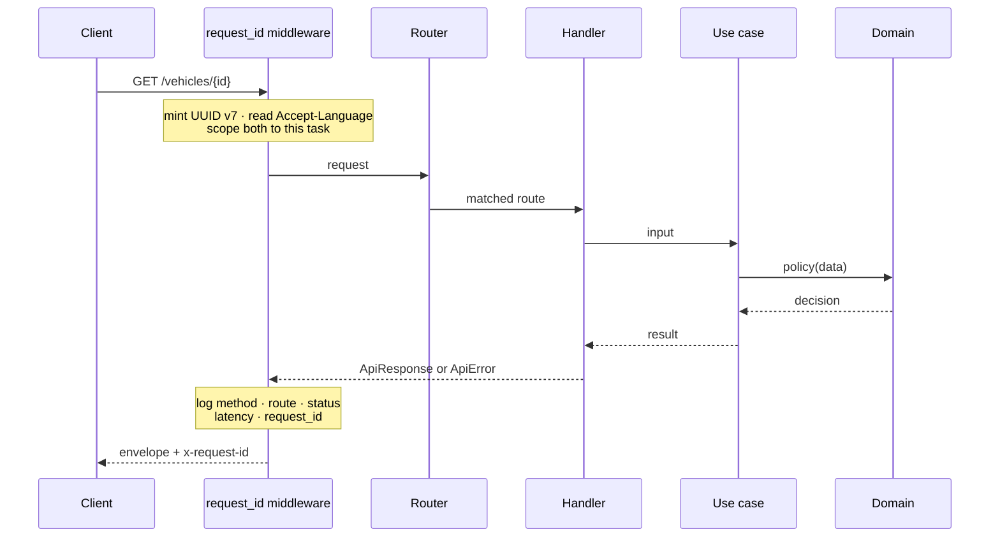
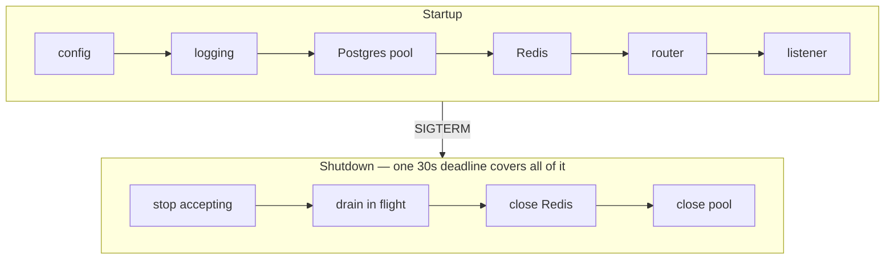

# anakmobil-api

The backend. Rust, axum, Postgres, Redis — one binary, two process roles.

Conventions and the reasoning behind them live in [CLAUDE.md](CLAUDE.md). This file is how to run it and how to find your way around.

## Run it

Requires Rust 1.96+ and a Postgres and Redis to talk to.

```bash
cp .env.example .env
make be-web        # from the repository root
```

The `make` targets live at the repository root because Cargo insists on being invoked inside its own workspace:

```bash
make be-web        # HTTP role
make be-worker     # background role
make be-check      # fmt · clippy · tests · the domain-boundary assertion
```

A throwaway pair of dependencies, if you have Docker:

```bash
docker run -d --name am-pg -e POSTGRES_PASSWORD=anakmobil -e POSTGRES_DB=anakmobil -p 5432:5432 postgres:17-alpine
```

```bash
docker run -d --name am-redis -p 6379:6379 redis:7-alpine
```

## What answers today

Two routes. There is no schema, no authentication, and no business endpoint yet.

| Route | Answers | Checks |
|---|---|---|
| `GET /healthz` | always `200` | nothing — no I/O at all |
| `GET /readyz` | `200` or `503` | Postgres and Redis, concurrently, 2s each |

```bash
curl -i localhost:8080/readyz
```

```jsonc
{ "status": "ready", "postgres": "ok", "redis": "ok" }
```

These two answer different questions, and conflating them is how you build a probe that cannot fail. Liveness asks whether the process is alive — a database being down is not a reason to restart it, because restarting will not bring the database back. Readiness asks whether *this instance* can serve, and Redis holds sessions, so an instance that cannot reach it cannot authenticate anyone.

Both answer flat JSON, deliberately outside the response envelope below. A load balancer is not an API client.

## A request, end to end



The identifier is always minted here, never read from an inbound `X-Request-Id` — a caller-supplied value that lands in a log line is how log injection works.

Both the id and the language are task-locals, not handler arguments. Arguments work for a successful response and fail for every other one: `?` returns an error value with nowhere to carry a request id, and the error path is exactly where a support conversation starts.

## The response envelope

Every endpoint answers in one shape, success or failure, so a client writes one parser.

```jsonc
{ "meta": { "request_id", "timestamp", "status" }, "data": { … } }
{ "meta": { "request_id", "timestamp", "status" }, "error": { "code", "message", "details"? } }
```

`meta` comes first so the person pasting a response into a support thread sees the request id before scrolling past the payload. `meta.status` is computed once from the same value that sets the status line. `204 No Content` writes no envelope at all.

**Error codes are the contract; messages are not.** A client switches on `code`. Messages are Bahasa Indonesia by default — an error message is product text — with English available through `Accept-Language`, and either may be reworded without breaking anyone.

A code maps to a status in exactly one `match`, over an enum. Adding a code that nobody mapped does not compile.

## Layout

```
crates/
├── domain/          PURE — entities, value objects, policy
└── runtime/
    ├── migrations/  sqlx resolves these relative to THIS crate
    └── src/
        ├── main.rs    launcher
        ├── lib.rs     roles, startup and shutdown order
        ├── usecase/   application services — own the transaction
        ├── adapter/   http · postgres · redis — translate only
        ├── platform/  config · logging · state · shutdown
        └── shared/    envelope · errors · error codes · request id
```

`crates/domain/Cargo.toml` contains `thiserror`, `uuid`, and `time`. No `axum`, no `sqlx`, no `serde`. That absence *is* the architecture: `use axum::Json;` inside the domain crate produces `error[E0432]: unresolved import`, not a lint someone can allow away. `make be-boundary` asserts it, and CI runs it on every push.

`runtime` is a library with a thin binary, mirroring `cmd/server/main.go`. Integration tests can drive the real router, and a type written before its first caller is public API rather than dead code.

## Startup and shutdown are mirror images



The deadline covers **all** of teardown, not just the drain. A timeout around draining alone bounds nothing: `PgPool::close` afterwards waits indefinitely for a connection still checked out, so one stuck handler turns a 30-second shutdown into an indefinite one and the platform's `SIGKILL` becomes the real shutdown mechanism.

Configuration is read before logging is installed, so its failures are the one thing that cannot be logged. Every problem is reported together:

```
Error: configuration is invalid (3 problem(s)):
  - `APP_ENV` is invalid: expected `development` or `production`, got `staging`
  - `DATABASE_URL` is required but not set
  - `BIND_ADDR` must include a port, got `0.0.0.0`
```

## What a log line may contain

Method, matched route pattern, status, latency, request id. Nothing else.

Never the URI. A URI carries whatever the caller put in it, and a reset token in a path segment is the normal case rather than the exotic one — so a request matching no route logs the constant `unmatched`:

```
INFO request method=GET route=unmatched status=404 latency_ms=0 request_id=01a0057f-389c-…
```

Never a request body and never a whole struct: a VIN cannot leak from a value never handed to a logging macro. Secrets in configuration are wrapped in `Secret<T>`, whose `Debug` prints `Secret(<redacted>)`. A 5xx cause is rendered at exactly one place, into the log — `ApiError::source` is private with no accessor, so no handler can route a cause into a response body.

## Adding an endpoint

1. Entity and policy in `crates/domain/src/<context>/` — no async, no I/O.
2. Repository in `runtime/src/adapter/postgres/`, taking `&mut PgConnection` so the **use case** owns the transaction.
3. Use case in `runtime/src/usecase/` — open the transaction, authorise, write, call policy, commit.
4. Handler in `runtime/src/adapter/http/`, returning `Result<ApiResponse<T>, ApiError>`.
5. Route it in `adapter/http/router`.

Repositories are concrete structs, not traits. A trait arrives when the adapter will genuinely be swapped, when orchestration needs an I/O seam to test without a network, or when a second implementation exists. `#[sqlx::test]` gives a transactional test database that also exercises the real SQL, which is more honest than a fake.

## Gate

```bash
make be-check
```

Individually, and this is what CI runs:

```bash
cargo fmt --check
cargo clippy --all-targets --all-features -- -D warnings
cargo test --workspace
cargo audit
cargo deny check
```

Not Sonar — its Rust support is thin. Clippy is the gate, and the workspace denies `unwrap`, `expect`, `panic!`, and `todo!()` outside tests, forbids `unsafe` crate-wide, and denies holding a lock across `.await`.

Never lower a threshold, blanket-`#[allow]` a lint, or delete a failing test to go green. `cargo deny` was red once and the fix was four real corrections to the manifests, not four allowances.

## The sqlx trap, before you write the first query

When `DATABASE_URL` is set, the `query!` macros check against the live database and **silently ignore** the committed `.sqlx` cache. A stale cache then passes locally and fails on any machine without a database.

Builds already run with `SQLX_OFFLINE=true`. The `cargo sqlx prepare --check` step is written into `.github/workflows/backend.yml` but **commented out** — there is no schema and no cache to check yet, so it would only produce a confusing red build. Uncomment it with the first migration in AM-353, and from then on re-run `cargo sqlx prepare` and commit the result whenever a query or migration changes.

The `macros` feature is not enabled on the `sqlx` dependency yet, for the same reason: nothing here writes SQL.

Migrations live in `crates/runtime/migrations/`, not at the workspace root — `sqlx::migrate!()` and `#[sqlx::test]` resolve the path relative to `CARGO_MANIFEST_DIR`.
