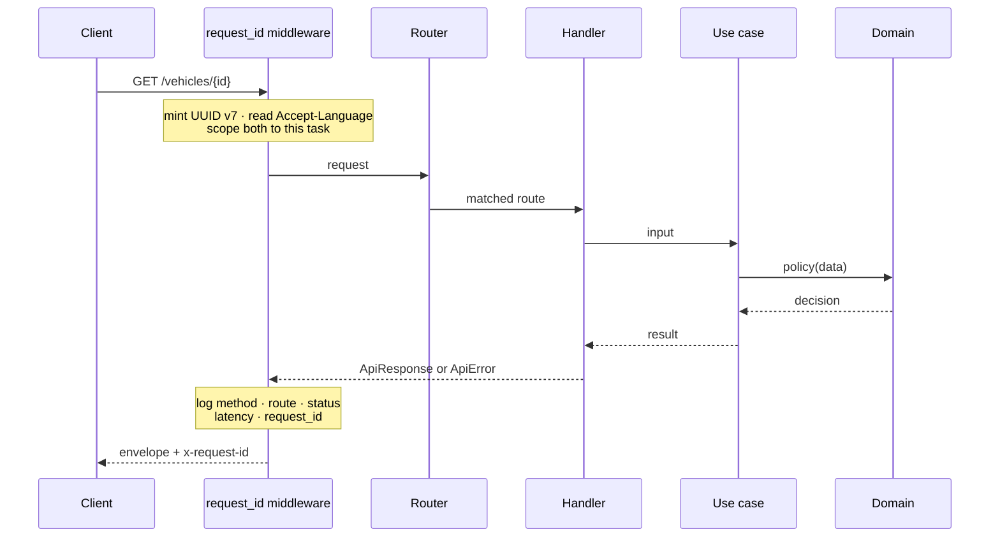
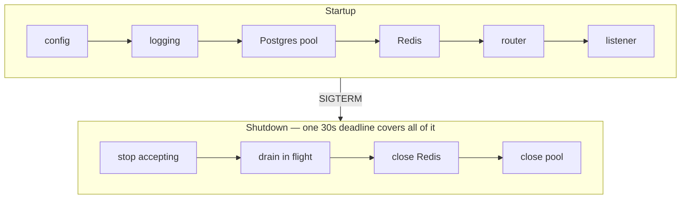

# anakmobil-api

The backend. Rust, axum, Postgres, Redis — one binary, two process roles.

Conventions and the reasoning behind them live in [CLAUDE.md](CLAUDE.md). This file is how to run it and how to find your way around.

## Run it

Requires Rust 1.96+ and a Postgres and Redis to talk to.

```bash
cp ../../.env.example ../../.env   # one .env, at the repository root
make be-web        # from the repository root
```

The `make` targets live at the repository root because Cargo insists on being invoked inside its own workspace:

```bash
make be-web        # HTTP role — applies migrations, then listens
make be-worker     # background role
make be-migrate    # apply migrations and exit
make be-check      # fmt · clippy · tests · the domain-boundary assertion
```

`anakmobil` also takes one command that is not a process role — there is no `make` target for it, since it wants a specific email and an interactive reason:

```bash
cd apps/api
echo "reason" | cargo run --bin anakmobil -- grant-admin <email>
```

Grants the first platform admin, when there is none. Reads the reason from stdin rather than from an argument, because an argument lands in shell history and in every `ps` listing on the box. Succeeds only when the platform has zero admins — which is a legitimate state, and this is the way back from it.

Postgres comes from `docker-compose.yml` at the repository root — **`pgvector/pgvector`, not `postgres`**, because the first migration enables the extension and the stock image cannot migrate at all:

```bash
make db-up         # Postgres on :55432
make db-up-all     # also Redis, for a machine without one
```

Redis is assumed to be running on your machine already, which is why it is not started by default. Postgres publishes on **55432** rather than 5432: a Homebrew postgres is commonly already there, and pointing at it does not fail cleanly — it is a real server with the wrong database and no pgvector.

## What answers today

Accounts, the caller's own cars, the catalog, service history, builds, and the
parts catalog. Everything AI is not built yet.

| Route | Answers | Checks |
|---|---|---|
| `GET /healthz` | always `200` | nothing — no I/O at all |
| `GET /readyz` | `200` or `503` | Postgres and Redis, concurrently, 2s each |
| `POST /auth/register` | `201` | email is free, password ≥ 8 characters |
| `POST /auth/login` | `200` | rate limit, then argon2id |
| `POST /auth/refresh` | `200` | rotates, and detects a replay |
| `POST /auth/logout` | `200` | ends that session only |
| `GET /vehicles` | `200` | the caller's cars, in their order, each with a summary |
| `POST /vehicles` | `201` | catalog match or a description |
| `GET /vehicles/{id}` | `200` | ownership |
| `PUT /vehicles/{id}` | `204` | ownership |
| `DELETE /vehicles/{id}` | `204` | ownership |
| `PUT /vehicles/order` | `204` | every listed car is the caller's |
| `GET /vehicles/{id}/summary` | `200` | ownership — spend, and what the car is due for |
| `GET /admin/users/{id}/vehicles` | `200` | platform admin — that person's cars, with no plate, VIN, price, or spend |
| `PATCH /admin/users/{id}/role` | `200` / `204` | platform admin, re-checked inside the transaction; `204` when the account already has that role, so a retry is safe |
| `GET /builds` | `200` | own builds plus `community`/`public` ones, cursor paged; cost is nulled **in the query** per `cost_visibility` unless the caller owns the car |
| `PUT /vehicles/{id}/build` | `204` | ownership |
| `GET /vehicles/{id}/build` | `200` | ownership — the build with its modifications, two queries |
| `GET /vehicles/{id}/services` | `200` | ownership, cursor paged, newest first |
| `POST /vehicles/{id}/services` | `201` | ownership, date not in the future, cost not negative |
| `POST /vehicles/{id}/build/modifications` | `201` | ownership; `part_id` or an inline `part`, never both; cost inside its range and scale |
| `GET /services/{id}` | `200` | ownership |
| `PUT /services/{id}` | `204` | ownership |
| `DELETE /services/{id}` | `204` | ownership |
| `PUT /modifications/{id}` | `204` | ownership; same part-choice and cost rules as the add |
| `DELETE /modifications/{id}` | `204` | ownership, idempotent — a repeat call still answers `204` |
| `GET /catalog/brands` | `200` | — |
| `GET /catalog/brands/{id}/models` | `200` | — |
| `GET /catalog/models/{id}/generations` | `200` | — |
| `GET /catalog/generations/{id}/variants` | `200` | — |
| `POST /catalog/suggestions` | `201` | brand and model present, daily allowance |
| `GET /parts` | `200` | category and text filter, limit capped; each part carries its two evidence counts |
| `POST /parts` | `201` | specs inside their ranges, daily allowance |
| `GET /parts/{id}` | `200` | evidence counts, same as the list |

```bash
curl -i localhost:8080/readyz
```

```jsonc
{ "status": "ready", "postgres": "ok", "redis": "ok" }
```

These two answer different questions, and conflating them is how you build a probe that cannot fail. Liveness asks whether the process is alive — a database being down is not a reason to restart it, because restarting will not bring the database back. Readiness asks whether *this instance* can serve, and Redis holds sessions, so an instance that cannot reach it cannot authenticate anyone.

Both answer flat JSON, deliberately outside the response envelope below. A load balancer is not an API client.

## Authentication

Both tokens are **opaque random strings**, not JWTs, and every authenticated request costs one Redis lookup. That is the price of the requirement: a signed JWT cannot be revoked, only waited out, so logout would be a gesture rather than an act.

```
access   1 hour    process memory on the client
refresh  90 days   Keychain / Keystore, behind biometrics
```

Two tokens even though both are opaque, because they are **stored differently on the device**. Someone who reads app memory gets an hour, not three months.

Redis stores a SHA-256 of each token and never the token. A dump, a stray `KEYS *`, or a misconfigured replica yields values that cannot be presented as credentials. SHA-256 rather than argon2 because the input is already 256 bits of CSPRNG output — there is nothing to slow an attacker down about, and this runs on every request.

**`sess:{id}` is the only authority.** Authenticating needs the token mapping *and* the session; revoking is one `DEL`, and orphaned token keys expire on their own.

**Rotation is a Lua script**, because it must be atomic. Two refreshes arriving together on separate commands can both consume the same token and mint two live chains for one session — one theft becoming two independent logins. There is a test that fails against the non-atomic version.

**A replayed refresh token revokes every session on the account** and does *not* fence it: the owner must be able to sign in again, or a stolen token becomes a permanent lockout of the victim. Account deletion is the case that does fence.

**Login answers identically** for an unknown email and a wrong password, down to the status and the error code, and burns one argon2 verification against a decoy hash when no account exists. Otherwise response timing alone tells an attacker which addresses are registered.

**Login is rate limited here** rather than in the general rate-limiting story. Argon2 costs 19 MiB and real CPU per attempt, so an unthrottled login endpoint is a cheap denial of service as well as a guessing machine — the hashing that protects stored passwords is what makes the endpoint expensive to serve.

## Private vehicle data

Plate, VIN, and purchase price live in `vehicle_private`, a separate table, and reach exactly one endpoint: the detail of a car, for the person who owns it.

The split is the enforcement. A filtered `SELECT` protects those columns until the first query that forgets one, and a leaked plate cannot be recalled — so they are not in the row a query returns by default. `SELECT * FROM vehicles` cannot leak a plate because there is no plate in `vehicles`.

The same shape repeats in the types: `VehicleResponse` has no field for a plate. Not a skipped field, not an `Option` that happens to be `None` — no field. Adding private data to a list response would require changing a type signature, which a reviewer sees. A test asserts the serialised shape carries none of those keys.

**"Not yours" and "does not exist" answer identically.** Both are `404`, so an id cannot be probed for existence.

**A car can exist without a catalog match.** Somebody whose model is missing must still be able to add their car, or the suggest-a-model flow has nothing to attach to and the catalog can only ever describe cars that were already enterable.

**Money crosses the wire as a decimal string.** JSON numbers are doubles in most clients, and the scale is pinned rather than inherited — a `BigDecimal` round trip otherwise renders 185000000.50 as `185000000.5000`, the same number in a different shape that every client would have to normalise.

## The catalog, and its escape hatch

Four read levels walking brand → model → generation → variant. Unpaginated: there are a few dozen car brands sold in Indonesia and a handful of variants per generation, so paginating a list that fits on one screen costs the client a loop for nothing.

An unknown parent yields an **empty level, not a 404**. The client is walking a tree it was just handed, and it treats "no models" and "no brand" the same way.

**The catalog will never be complete.** Grey imports, unlisted facelifts, models that lasted two years. So `POST /catalog/suggestions` records what is missing, and a car can be added with a typed description instead of a catalog match — otherwise the catalog could only ever describe cars that were already in it.

Suggestions are **not** deduplicated. The same missing model reported forty times is the clearest demand signal curation will ever get; merging them throws it away. Grouping happens when the queue is read.

A suggestion **outlives the account that filed it** (`ON DELETE SET NULL`). What was reported is catalog work, not personal data, and losing it because somebody later closed their account would discard the only record that the gap exists.

## A request, end to end



The identifier is always minted here, never read from an inbound `X-Request-Id` — a caller-supplied value that lands in a log line is how log injection works.

Both the id and the language are task-locals, not handler arguments. Arguments work for a successful response and fail for every other one: `?` returns an error value with nowhere to carry a request id, and the error path is exactly where a support conversation starts.

## The response envelope

Every endpoint answers in one shape, success or failure, so a client writes one parser.

```jsonc
{ "meta": { "request_id", "timestamp", "status" }, "data": { … } }
{ "meta": { "request_id", "timestamp", "status" }, "error": { "code", "message", "details"? } }
```

`meta` comes first so the person pasting a response into a support thread sees the request id before scrolling past the payload. `meta.status` is computed once from the same value that sets the status line. `204 No Content` writes no envelope at all.

**Error codes are the contract; messages are not.** A client switches on `code`. Messages are Bahasa Indonesia by default — an error message is product text — with English available through `Accept-Language`, and either may be reworded without breaking anyone.

A code maps to a status in exactly one `match`, over an enum. Adding a code that nobody mapped does not compile.

## Layout

```
crates/
├── domain/          PURE — entities, value objects, policy
└── runtime/
    ├── migrations/  sqlx resolves these relative to THIS crate
    └── src/
        ├── main.rs    launcher
        ├── lib.rs     roles, startup and shutdown order
        ├── usecase/   application services — own the transaction
        ├── adapter/   http · postgres · redis — translate only
        ├── platform/  config · logging · state · shutdown
        └── shared/    envelope · errors · error codes · request id
```

`crates/domain/Cargo.toml` contains `thiserror`, `uuid`, and `time`. No `axum`, no `sqlx`, no `serde`. That absence *is* the architecture: `use axum::Json;` inside the domain crate produces `error[E0432]: unresolved import`, not a lint someone can allow away. `make be-boundary` asserts it, and CI runs it on every push.

`runtime` is a library with a thin binary, mirroring `cmd/server/main.go`. Integration tests can drive the real router, and a type written before its first caller is public API rather than dead code.

## Startup and shutdown are mirror images



The deadline covers **all** of teardown, not just the drain. A timeout around draining alone bounds nothing: `PgPool::close` afterwards waits indefinitely for a connection still checked out, so one stuck handler turns a 30-second shutdown into an indefinite one and the platform's `SIGKILL` becomes the real shutdown mechanism.

Configuration is read before logging is installed, so its failures are the one thing that cannot be logged. Every problem is reported together:

```
Error: configuration is invalid (3 problem(s)):
  - `APP_ENV` is invalid: expected `development` or `production`, got `staging`
  - `DATABASE_URL` is required but not set
  - `BIND_ADDR` must include a port, got `0.0.0.0`
```

## What a log line may contain

Method, matched route pattern, status, latency, request id. Nothing else.

Never the URI. A URI carries whatever the caller put in it, and a reset token in a path segment is the normal case rather than the exotic one — so a request matching no route logs the constant `unmatched`:

```
INFO request method=GET route=unmatched status=404 latency_ms=0 request_id=01a0057f-389c-…
```

Never a request body and never a whole struct: a VIN cannot leak from a value never handed to a logging macro. Secrets in configuration are wrapped in `Secret<T>`, whose `Debug` prints `Secret(<redacted>)`. A 5xx cause is rendered at exactly one place, into the log — `ApiError::source` is private with no accessor, so no handler can route a cause into a response body.

## Adding an endpoint

1. Entity and policy in `crates/domain/src/<context>/` — no async, no I/O.
2. Repository in `runtime/src/adapter/postgres/`, taking `&mut PgConnection` so the **use case** owns the transaction.
3. Use case in `runtime/src/usecase/` — open the transaction, authorise, write, call policy, commit.
4. Handler in `runtime/src/adapter/http/`, returning `Result<ApiResponse<T>, ApiError>`.
5. Route it in `adapter/http/router`.

Repositories are concrete structs, not traits. A trait arrives when the adapter will genuinely be swapped, when orchestration needs an I/O seam to test without a network, or when a second implementation exists. `#[sqlx::test]` gives a transactional test database that also exercises the real SQL, which is more honest than a fake.

## Gate

```bash
make be-check
```

Individually, and this is what CI runs:

```bash
cargo fmt --check
cargo clippy --all-targets --all-features -- -D warnings
cargo test --workspace
cargo audit
cargo deny check
```

Not Sonar — its Rust support is thin. Clippy is the gate, and the workspace denies `unwrap`, `expect`, `panic!`, and `todo!()` outside tests, forbids `unsafe` crate-wide, and denies holding a lock across `.await`.

Never lower a threshold, blanket-`#[allow]` a lint, or delete a failing test to go green. `cargo deny` was red once and the fix was four real corrections to the manifests, not four allowances.

## The sqlx trap, before you write the first query

When `DATABASE_URL` is set, the `query!` macros check against the live database and **silently ignore** the committed `.sqlx` cache. A stale cache then passes locally and fails on any machine without a database.

Builds already run with `SQLX_OFFLINE=true`. The `cargo sqlx prepare --check` step is written into `.github/workflows/backend.yml` but **commented out**, and it stays that way until the first `query!` — not the first migration. A schema exists now; a `.sqlx` cache does not, because the cache records queries and there are none. Uncomment it with the first repository, and from then on re-run `cargo sqlx prepare` and commit the result whenever a query or migration changes.

The `macros` feature is not enabled on the `sqlx` dependency yet, for the same reason: nothing here writes SQL.

Migrations live in `crates/runtime/migrations/`, not at the workspace root — `sqlx::migrate!()` and `#[sqlx::test]` resolve the path relative to `CARGO_MANIFEST_DIR`.
