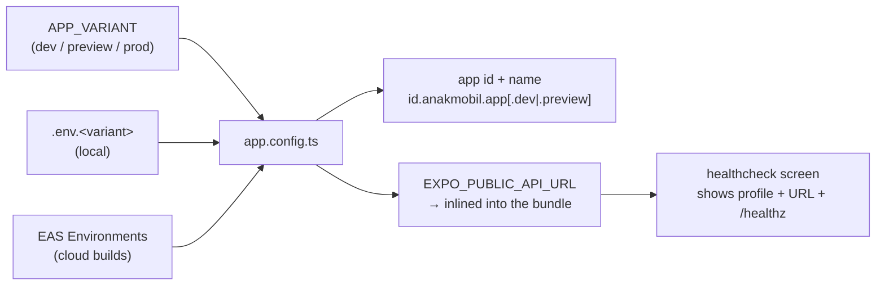

# @anakmobil/mobile

The AnakMobil.id mobile app — React Native via Expo, in the repository's Bun workspace. This is the **bootstrap** (AM-14): it installs, type/lint-gates, runs on a real device against a per-profile API URL, and has its own CI job. There is no design system, no navigation, and no API client yet — each is its own story.

## Stack

- **Expo SDK 57** · **Expo Router** (file-based, typed routes) · React Native 0.86 / React 19
- **Custom dev client** from the first build (not Expo Go) — `expo-dev-client`
- **TypeScript strict**, no explicit `any`
- **Bun** (workspace member; the repo has one root `bun.lock`)
- **EAS** configured (`eas.json`) for cloud builds — not required for local development

## Prerequisites

- **Xcode** (iOS) and/or **Android Studio** (Android)
- **Node LTS** on `PATH` — Bun runs everything else, but `expo prebuild` shells to `npm pack` internally
- For a **physical iPhone**: an Apple signing identity (a free personal team works — the device is registered, the app re-signed ~weekly on the free 7-day certificate, and the developer certificate trusted once under Settings). The iOS **simulator** needs none of this; Android debug builds self-sign.
- The API running and reachable — `make be-web` (binds `0.0.0.0:8080`)

## Commands

All `make` targets run from the **repository root**.

```bash
make mb-check                 # gate: generate typed routes → tsc --noEmit → expo lint
make mb-run-dev p=ios         # build+install the dev client on a device/simulator (p=ios|android)
make mb-run-preview p=ios     # the preview profile
make mb-run-prod p=ios        # the production profile
bun run --filter @anakmobil/mobile start   # Metro only, once a dev client is installed
```

First run builds the native app locally (`expo run:*`); after that, `start` (Metro) is the day-to-day loop against the installed dev client.

## Environment profiles

The app carries exactly one build-time value: **`EXPO_PUBLIC_API_URL`** — the API base URL. It is the only variable prefixed `EXPO_PUBLIC_`, because that prefix is the only thing Expo inlines into the bundle. Nothing secret is ever put here; a secret would never be given that prefix, and anything the app must not reveal is fetched from the API against the user's own session, never compiled in.



- **`.env.development`** is committed (an example pointing at a LAN IP — see below). `.env.preview` / `.env.production` are the developer's own, or pulled with `eas env:pull`, and stay gitignored.
- **The dev URL is the machine's LAN IP, not `localhost`.** A physical phone's loopback is the phone itself, so a build pointed at `localhost` fails on a real device. Find yours with `ipconfig getifaddr en0` and edit `.env.development`.
- The `mb-run-<variant>` targets set `APP_VARIANT` and source the matching env file so the right URL is inlined; the healthcheck screen (`src/app/index.tsx`) prints the resolved profile and URL so a wrong one is obvious on first launch.

## Structure

```
app.config.ts        dynamic config — APP_VARIANT → app id/name, env file, EAS projectId
eas.json             development / preview / production build profiles
src/app/_layout.tsx  root layout (bare Stack — no navigation yet)
src/app/index.tsx    healthcheck screen
.env.development      committed example (LAN IP)
```

CI: `.github/workflows/mobile.yml` runs `mb-check` (type-clean + lint-clean) on every change under `apps/mobile/`. It does not build a native binary — that is local (`expo run:*`) or on-demand in the cloud (`eas build`).
